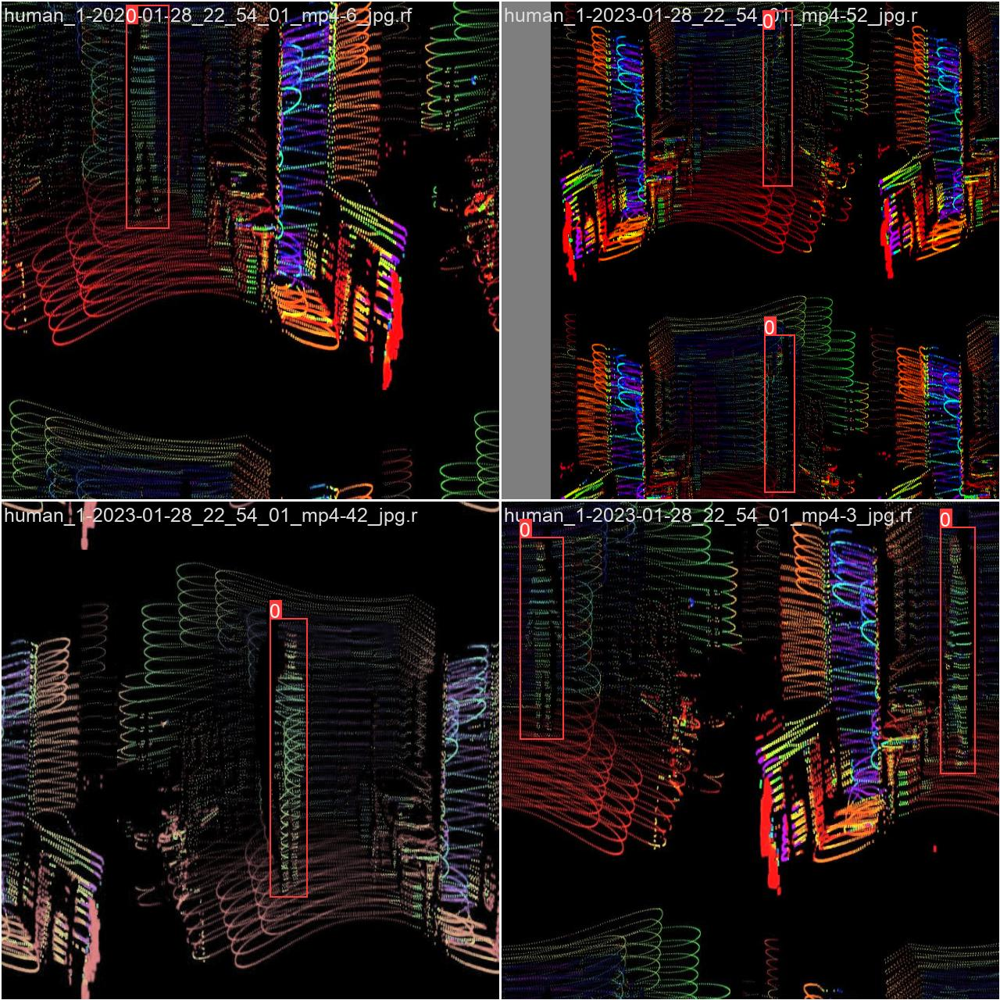
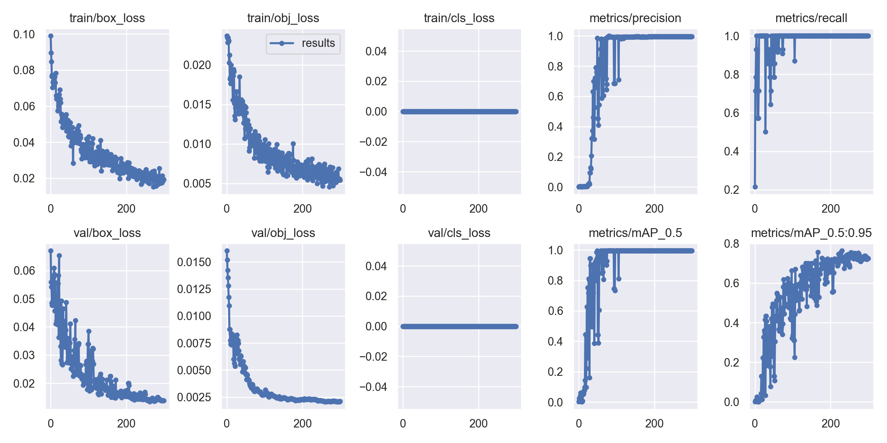

# Real-Time Human Detection in 3D Lidar PointCloud data using YOLOv5

## Introduction
This project aims to detect human in a 3D Lidar dataset using YOLOv5. The 3D Lidar dataset is labeled using Roboflow to detect and classify the human instances in the point cloud data.


## Detection results on PointCloud videos


## Dataset
The data are collected with Livox Horizon lidar and saved into rosbags. By playing the rosbags, we run our models on Rviz (visulization tools) where the pointcloud are visulized. The color of each point in Rviz represents the intensity value which is detemined by the object's surface material. You can find more detatils and raw data in following links:

- LiDAR model: Livox Horizon [Link](https://www.livoxtech.com/3296f540ecf5458a8829e01cf429798e/assets/horizon/Livox%20Horizon%20user%20manual%20v1.0.pdf)
- RAW Video links: [video 1](https://drive.google.com/file/d/1tlcPAzYt4d4AADS09ovMYHw57ckD3Rg-/view?usp=share_link) [Vodeo 2](https://drive.google.com/file/d/1h5_iHt8_xDyza6MfaLG8PX_SFe5flEHv/view?usp=share_link)
- rosbags: [rosbag 1](https://drive.google.com/file/d/1_nim3RnlPrpJYBtuoplnnh1xvGNxsjse/view?usp=share_link) [rosbag 2](https://drive.google.com/file/d/1lNxzqA7J6D9TP1uM1_d9JqztiOOaKTg0/view?usp=share_link)
- Train

### 1.Label dataset
  - [Roboflow](https://roboflow.com/?ref=ultralytics) can label, prepare, and host custom data automatically in YOLO format, and create [data.yaml](dataset_sample/data.yaml).
    ```
    train: ../train/images
    val: ../valid/images
    test: ../test/images

    nc: 1
    names: ['human']

    roboflow:
      workspace: project
      project: yolo_dection
      version: 1
      license: MIT
      url: https://universe.roboflow.com/project/yolo_dection/dataset/1
    ```

    


### 2. Select a Model
- YOLOv5m, a medium-sized model, is selected in our projects. The different size of YOLOv5 series shows as follow:
  


### 3. Training process
#### 3.1. Training images
- Example training images:

  

#### 3.2 train model

- Use Single-GPU training with [train.py](train.py)
  ```
  !export LD_LIBRARY_PATH=/usr/local/lib64:$LD_LIBRARY_PATH
  !python3 train.py --img 640 --batch 4 --epochs 300 --data /home/qing/Desktop/SummerProject/data.yaml --cfg /media/qing/KINGSTON/2023-01-28/yolov5/models/yolov5m.yaml --weights yolov5m.pt --name yolov5s_results

  ```
All training results are saved to runs/train/ with incrementing run directories, i.e. runs/train/exp2, runs/train/exp3 etc

- Trainning detatils

  


All trained results can be found [here](https://drive.google.com/drive/folders/151fcPESqJP-NY-gvCSvF6nXvro1oyViC?usp=share_link)


#### 3.3 valid results
- We tested our trained model on test images, here we shows part of the results.

  

### 4. Video recognition
- Objects in the video can be identified by running functions in [detect.py](detect.py).
    ```
    !python3 detect.py --weights  {RES_DIR}/weights/best.pt \
    --source {data_path} --name {INFER_DIR}
    ```
- The weights can be downloaded from [here](https://drive.google.com/file/d/16_3FfbGeiBYJSeAmyaQfgxUbALav9bhy/view?usp=share_link)
- Video Results

  

