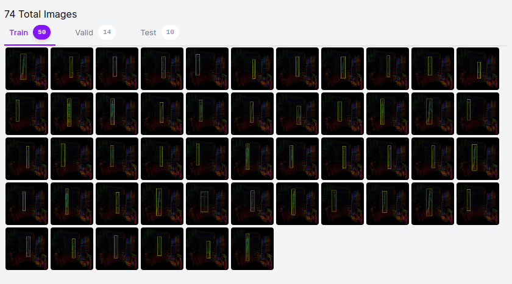
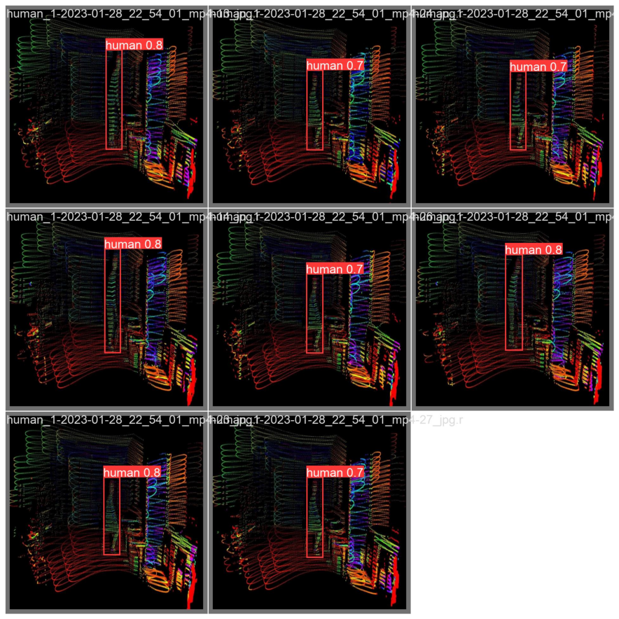

# Real-Time Human Detection in 3D Lidar PointCloud data using YOLOv5

## Introduction
This project aims to detect human in a 3D Lidar dataset using YOLOv5. The 3D Lidar dataset is labeled using Roboflow to detect and classify the human instances in the point cloud data.


3D Lidar point cloud(one person) |  3D Lidar point cloud(two persons) 
:-------------------------:|:-------------------------:
  |  


LiDAR model: Livox Horizon

### 1.creat dataset
[Roboflow](https://roboflow.com/?ref=ultralytics)can label, prepare, and host custom data automatically in YOLO format.


### 2. Select a Model
I selected YOLOv5m, a medium-sized model.


### 3. Train
#### 3.1.Visualize a few training images


#### 3.2 train model

Use Single-GPU training with [train.py](train.py)
```
!export LD_LIBRARY_PATH=/usr/local/lib64:$LD_LIBRARY_PATH
!python3 train.py --img 640 --batch 4 --epochs 300 --data /home/qing/Desktop/SummerProject/data.yaml --cfg /media/qing/KINGSTON/2023-01-28/yolov5/models/yolov5m.yaml --weights yolov5m.pt --name yolov5s_results

```
All training results are saved to runs/train/ with incrementing run directories, i.e. runs/train/exp2, runs/train/exp3 etc

#### 3.3 valid results



### 4. Video recognition
Objects in the video can be identified by running functions in [detect.py](detect.py).
```
!python3 detect.py --weights  {RES_DIR}/weights/best.pt \
--source {data_path} --name {INFER_DIR}
```

